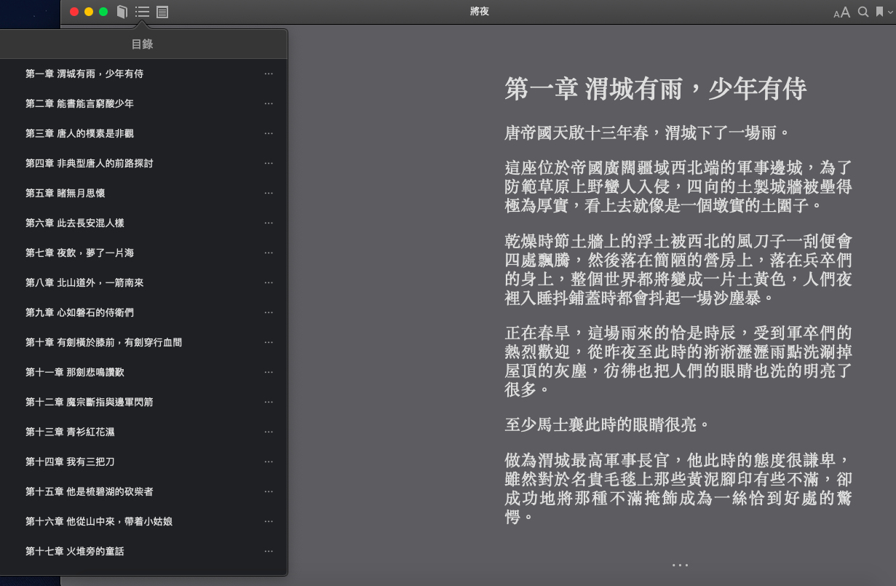

Novel Crawler
---

> 最晚確認可用：2022/01/31

- **目標**：爬取小說，轉成通用電子書格式（epub）。
- **說明**
  - 之前看網路小說一直是在[愛下電子書](https://tw.ixdzs.com/novel/%E5%B0%87%E5%A4%9C)下載epub，近幾天找小說時發現該網站不支援下載閱讀了，只能線上觀看，因此為了方便以後kindle上有書看，寫了一個工具。
- **用處**
  - 可透過輸入關鍵字搜索小說。
  - 可爬取全書章節製作成epub電子書格式。
- **指令**
  - `python3 src/crawler.py`
  - 需安裝`pypandoc`、`bs4`、`requests`等庫。
- **Demo Picture**：epub保留跳章、作者等資訊（在mac預覽）
  